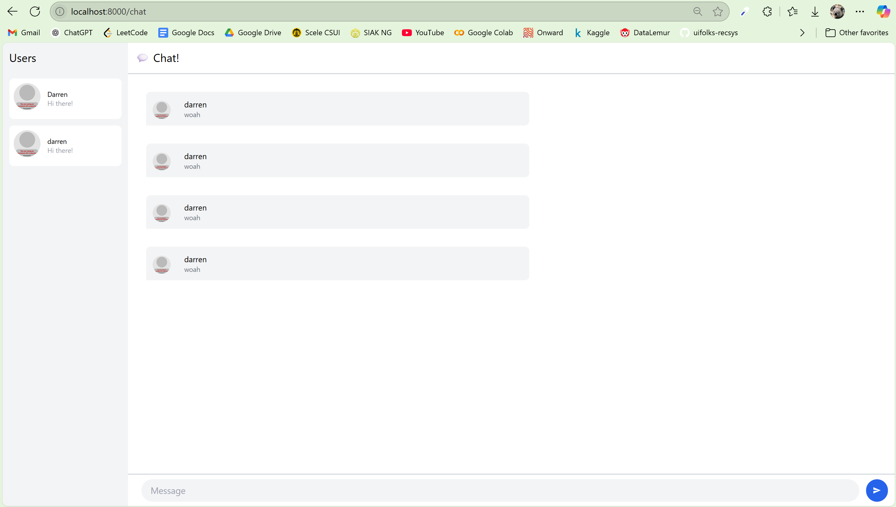

# Module 10 Reflection

### Original

### Modified

I've added an easy-to-use emoji picker to YewChat to make conversations more fun and expressive. There's now a button in the chat interface that opens a small popup showing 16 popular emojis. Users can click any emoji to instantly add it to their message. The emoji panel closes automatically after an emoji is picked or a message is sent, so it doesn’t interrupt the chat flow. This feature adds emotional tone to messages and works smoothly without needing extra libraries or backend changes.